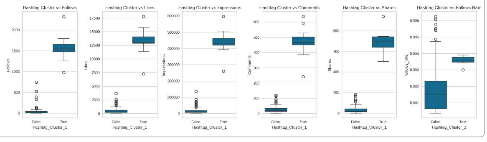

# Instagram Analysis | Análise do Instagram

**English:**
👉 The complete analysis with results, final remarks and recommendations is available here: [basic_instagram_analysis.ipynb](basic_instagram_analysis.ipynb) 

**Português:**
👉 A análise completa com resultados, considerações finais e recomendações está disponível aqui: [basic_instagram_analysis.ipynb](basic_instagram_analysis.ipynb) 

## 📊 Dashboard Preview | Visualização do Dashboard

## 📊 Data Overview | Visão Geral dos Dados
**English:** This project analyzes comprehensive Instagram data including:
- **Engagement information**: From home, hashtags, feed or other
- **Interaction information**: likes, comments, shares, saves, profile visits, follows 
- **Content information**: Caption and hashtags used

**Português:** Este projeto analisa dados abrangentes do Instagram, incluindo:
- **Informações de engajamento**: da página inicial, hashtags, feed or outro
- **Informações de interação**: curtidas, comentários, compartilhamentos, publicações salvas, visitas no perfil, ganho de seguidores
- **Informações do conteúdo**: Legenda com texto descritivo e hashtags utilizadas

## ✨ Key Features | Principais Funcionalidades
- **Follower's gain analysis** | **Análise de ganho de seguidores**
- **Hashtags effect on gaining followers** | **Efeito das hashtags usadas no ganho de seguidores**
- **Best hashtags to use to optimize increasing followers** | **Melhores hashtags para usar para otimizar o ganho de seguidores**

## 📁 Files Included | Arquivos Incluídos
- `basic_instagram.png` - Dashboard screenshot | Captura de tela do dashboard
- `Instagram data.csv` -  Data file | Arquivo de dados
- `basic_instagram_analysis.ipynb` - Jupyter notebook with complete analysis | Jupyter notebook com análise completa 

